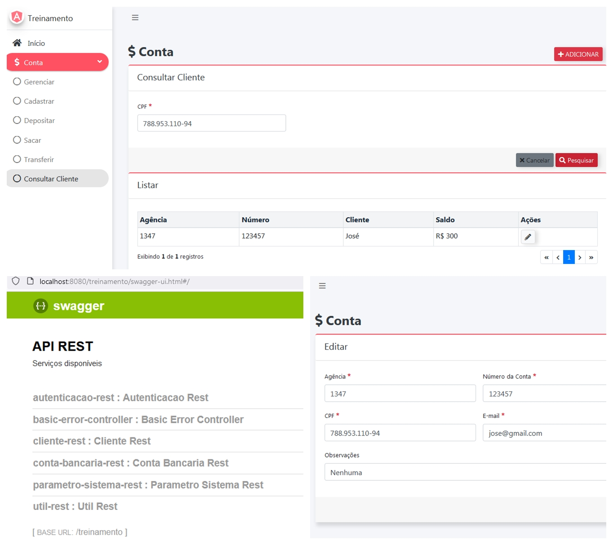

## :rocket: Indra - Treinamento Java + Angular

### :art: Layout

  

----------

### :hammer_and_wrench: Ferramentas
As seguintes tecnologias foram utilizadas na construção do projeto:
- Java:
  - IDE - Spring Tool Suite 4;
  - Swagger;
- Angular:
  - IDE - Visual Studio Code;
  - Service;
  - Module;
  - Routing;
  - TypeScript.

----------

###  :computer: Servidor de Desenvolvimento

Para clonar o repositório do git:
1. git remote add origin git remote add origin https://github.com/josegustavo312/indra-treinamento_java-angular.git
2. git branch -M main
3. git push -u origin main

Angular:

- Instalar o Angular CLI no projeto:
  - npm install -g @angular/cli
- Instalar as dependências:
  - npm install
- Executar o projeto:
  - ng serve
- Porta de desenvolvimento:
  - http://localhost:4200

API REST:

- Arquivo de configuração do banco:
  - treinamento_202105\controller\src\main\resources\application.yml
  
- Executar o Spring Boot App:
  1. treinamento_202105\controller\src\main\java\com\indracompany\treinamento\AppConfig.java
  2. Run As
  3. Spring Boot App

- Swagger UI:
  - http://localhost:8080/treinamento/swagger-ui.html#/

----------

###  :gear: Funções
- [x] Conta bancária:
  - [x] Gerenciar;
  - [x] Cadastrar;
  - [x] Depositar;
  - [x] Sacar;
  - [x] Transferir;
  - [x] Consultar Cliente.

----------

###  :eyeglasses: Autor
José Gustavo da Silva.
 

